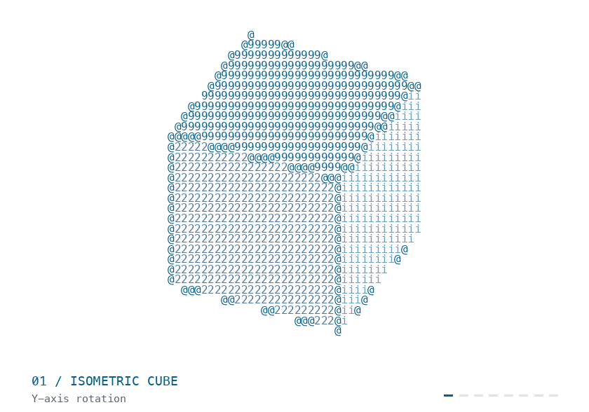
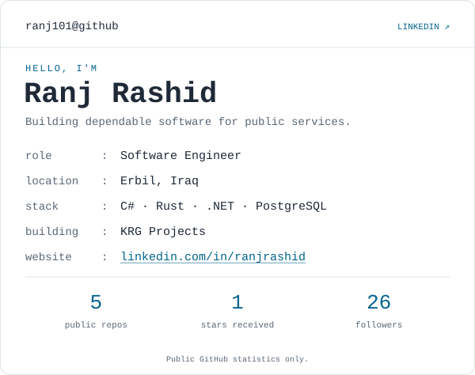

<!-- PROFILE:START -->

<picture>
  <source media="(prefers-reduced-motion: reduce) and (prefers-color-scheme: dark)" srcset="ascii-profile/assets/motion-dark-poster.png">
  <source media="(prefers-reduced-motion: reduce)" srcset="ascii-profile/assets/motion-light-poster.png">
  <source media="(prefers-color-scheme: dark)" srcset="ascii-profile/assets/motion-dark.gif">
  
</picture>

<a href="https://www.linkedin.com/in/ranjrashid/">
<picture>
  <source media="(prefers-color-scheme: dark)" srcset="ascii-profile/assets/profile-dark.svg">
  
</picture>
</a>

<!-- PROFILE:END -->
